Source: THM - Splunk: Exploring SPL
Date: 2026:03:25

## Source & Reporting

Search Head: Where analysts put the queies to filter or aggregate log data
Time Picker: Provides multiple options to select the timeframe of your search
Search History: Saves 's search queries that have previously been used
Data Summary: Provides a summary of the hosts, sources, and sourcetypes available

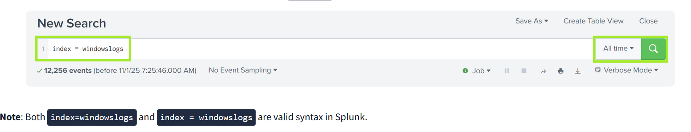

### Fields Sidebar

Selected Fields: The default extracted fields. You can select other fields by clicking them and toggling Selected
Interesting Fields: Pulls all the interesting fields it finds and displays them in the left panel to further explore
Numeric Fields #: This symbol represents fields that contain numerical values
Alpha-numeric Fields α: The alpha symbol represents fields that contain strings (text values)
Count: The number of events containing the listed field
More available fields: If more fields are available, they can be accessed and selected here

## Search Operators

    - Free Text Search
        EX. index=windowslogs **alice**
        If don't know field names, or just run a quick search

## Relational Operators

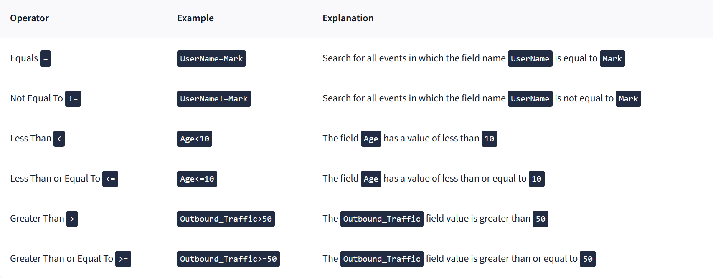

## Logical Operators

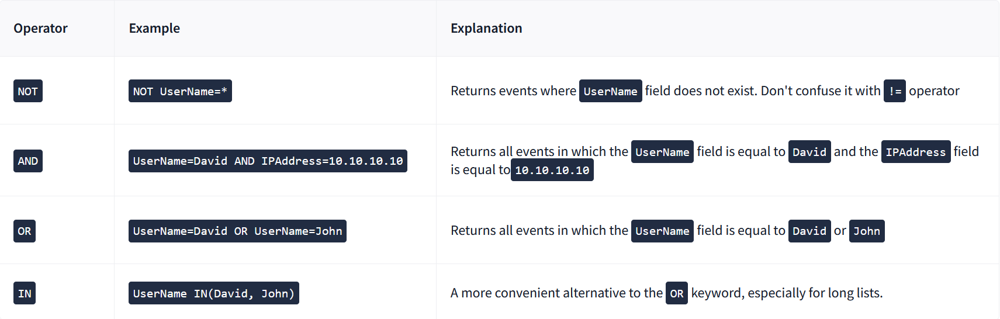

## Wildcards and CIDR Search

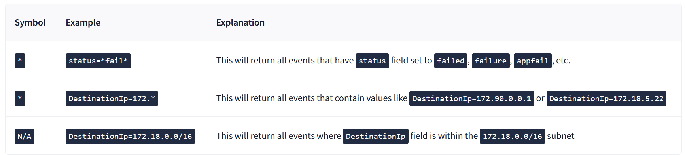

## Fields

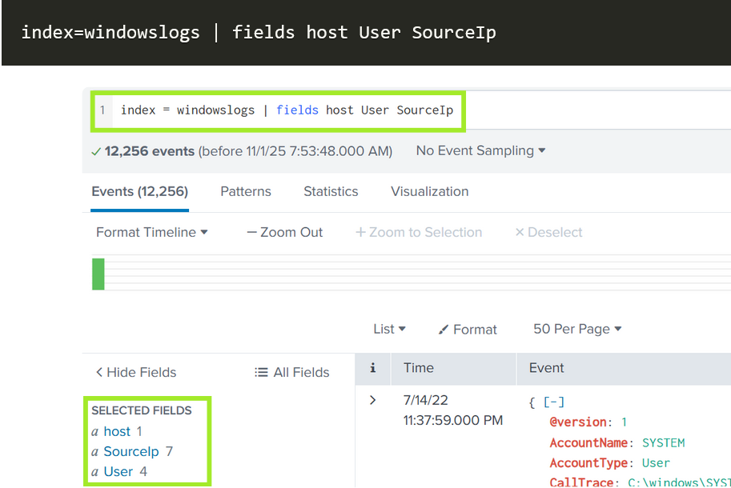

## Dedup

The dedup command removes duplicate values from your search results. For example, if our logs contain seven distinct IP addresses in the SourceIp field, the results will return seven events, one for each unique IP. The command is useful for subsearches and for cleaning identical events (e.g., Microsoft 365 often sends 50 events for a single activity).

## Rename

The rename command allows you to change the name of a field in your search results. This can help improve the readability of your search results, especially if the original fields are too long or not suitable for showing them in the screenshots in formal SOC reports.

## Regex

The regex command allows you to filter search results using regular expressions, which match specific text patterns in field values. This is useful when you need to find events that follow a specific format rather than an exact keyword. Splunk regular expressions are PCRE (Perl Compatible Regular Expressions) and use the PCRE C library.

## Table Command

The table command allows you to select only the fields you are interested in viewing and displays them in a clean, readable format. This is especially useful when building timelines, investigating specific hosts or users, or comparing multiple fields. This query will create a table out of named fields and organize them by timestamp. Use the table command to answer the first question.

## Useful Structuring Commands

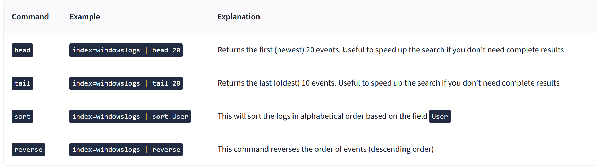

## Timelining With Table

The table command can be used to create timelines that help analysts visualize how events unfolded. By organizing key fields, we can reconstruct the sequence of actions that occurred on a system. For example, we can list all actions happening on the Salena.Adam host in a chronological order, and then exclude system noise or add additional columns, if required.

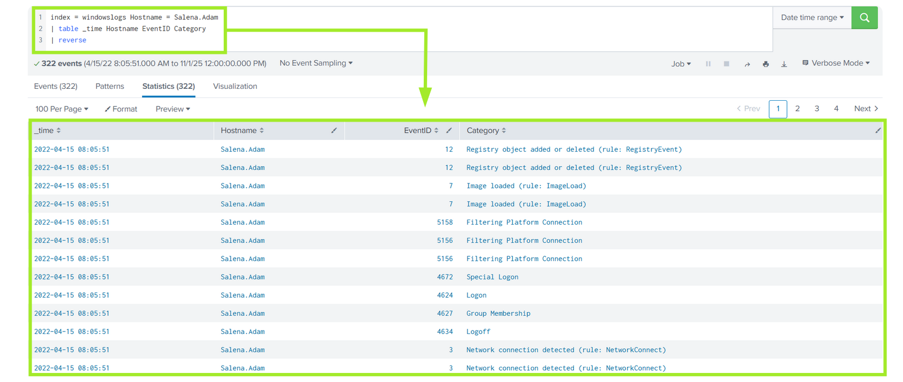

## Subsearches

Imagine you are reviewing Sysmon process creation events and want to understand their logon context: did a process originate from a remote session (LogonType 3/10) or a service (LogonType 5)? Sysmon doesn't log the LogonType field, so you need to correlate across two data sources: Sysmon ID 1 for the process creation, and Security ID 4624 for the logon context. The LogonId field, present in both, is your link between them:

    You get the Image, User, LogonId from the original Sysmon event (EventID=1)
    Using LogonId field, you find the corresponding Logon event (EventID=4624)
    You get the LogonType and IpAddress from the corresponding Logon event

With Splunk subsearches (opens in new tab) and join keyword, you can correlate across multiple data sources within one search, and, for our example, build a unified tablecontaining both process and logon details:

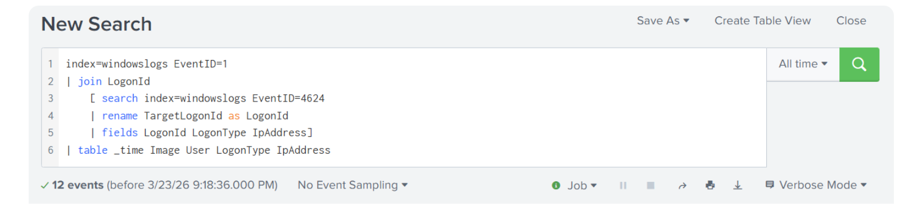

## Transforming Commnads

Allow you to change raw event data into useful summaries, statistics, and visualizations. Instead of viewing every individual log, they help analysts aggregate, count, and analyze patterns across many events. Searches that utilize transforming commands are referred to as transforming searches in .

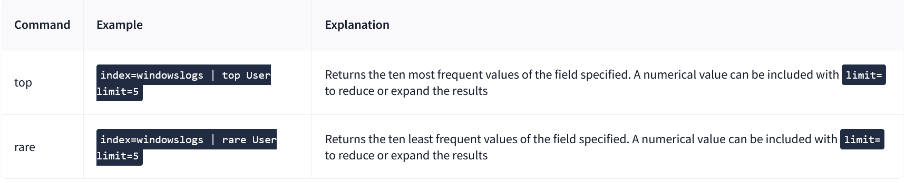

## Stats

The stats command is a powerful tool in Splunk. It allows you to calculate statistics, such as counts, sums, and averages, of fields within your search results. This can be useful when summarizing large volumes of data to identify trends or anomalies. The table below covers some standard stats functions.

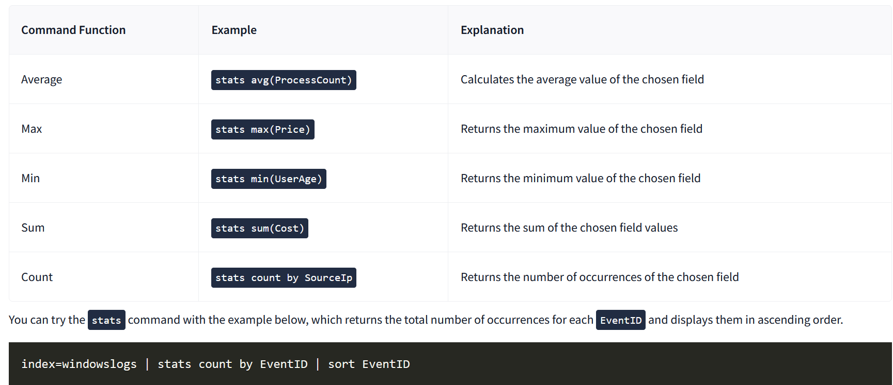

## Chart

The chart (opens in new tab) command returns your search results in a table, which you can then use to create helpful visualizations. This command utilizes many of the same functions as stats. Let's give it a shot to visualize the count of events containing the User field with this query.

## Timechart

The timechart command is used to visualize how data changes over time. It is beneficial for spotting trends, peaks, and anomalies in your log data. In the example below, we use timechart to track process activity over time. The following query removes any NULL Image field values and creates a time-based area chart showing the top five most frequently occurring process images within 30-minute intervals.

```
index=windowslogs Image!="" | timechart span=30m count by Image limit=5

```
## IP Location

You can use the iplocation command to enrich your search results with geographic information about IP addresses. It uses Splunk's built-in geolocation tables to add fields such as City, Region, and Country. Try it out with the query below.

```
index=windowslogs | iplocation SourceIp | stats count by Country
```

## Lookup

Similarly, lookup is used to enrich events using external data sources. It matches a field in your search to a corresponding field in a CSV file or lookup table. In this example, a CSV was created that associates the Hostname field with an employee role signified by UserRole.

```
index=windowslogs
| lookup user_roles Hostname OUTPUT UserRole
| stats count by Hostname UserRole

```

## Eval

The eval command is one of the most versatile tools in Splunk. It allows you to create new fields, modify existing ones, and perform calculations directly within your searches. It can be used to make data more readable and prepare fields for use in visualizations. In the example below, we created a new field called LogonTypeDesc to give a more descriptive name to numeric LogonType values.

```
index=windowslogs
| eval LogonTypeDesc = case(LogonType == 3, "Network Logon", LogonType == 5, "Service")
| stats count by LogonType LogonTypeDesc
```

## Anomaly Detection

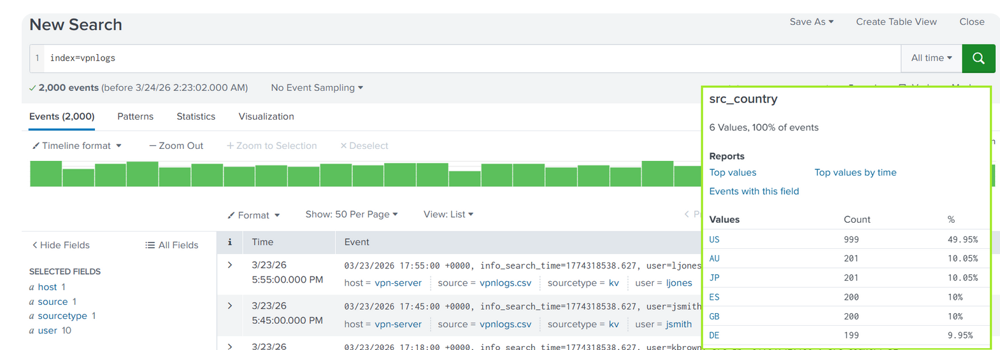

## Detecting Outliers by Country

```
index=vpnlogs
| eventstats count as logins_by_user by user 
| eventstats count as logins_by_user_country by user src_country 
| eval country_freq=logins_by_user_country/logins_by_user
| where country_freq < 0.1
| table _time user src_ip src_country country_freq

```

## Detecting Outliers by Hour

```
index=vpnlogs
| eval hour=tonumber(strftime(_time, "%H")) + tonumber(strftime(_time, "%M"))/60
| eventstats avg(hour) as typical_hour stdev(hour) as stdev_hour by user
| eval zscore=abs(hour - typical_hour) / stdev_hour
| where zscore > 3
| eval hour=round(hour, 2), typical_hour=round(typical_hour, 2)
| eval stdev_hour=round(stdev_hour, 2), zscore=round(zscore, 2)
| table _time user src_ip src_country hour typical_hour stdev_hour zscore
| sort - hour_zscore
```

