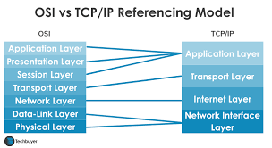
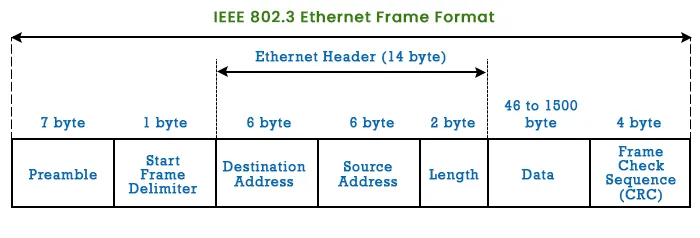
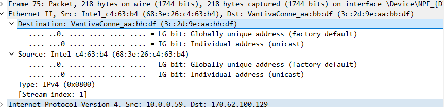
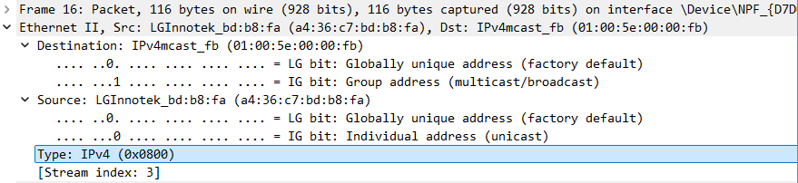
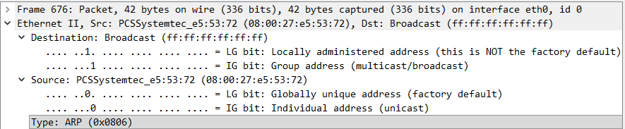
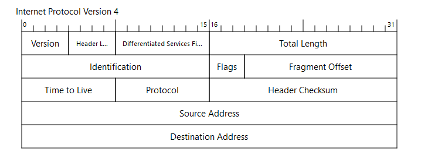
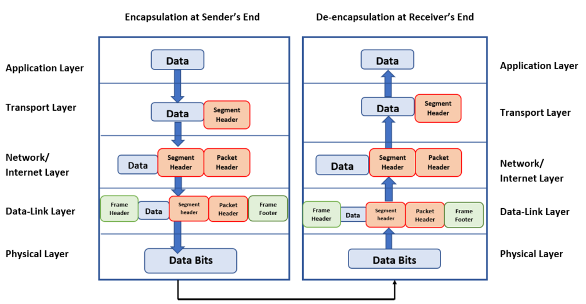

# Anatomy of a Packet (Review)

## Ethernet - The Frame Header

## Unicast | Broadcast | Multicast

### Unicast example:

### Multicast example:

### Broadcast example:

## The Internet Protocol - Learning the Header Values

## IPv4 Header

### Important Troubleshooting v4 values:
    - ID - unique ID per packet > some systems are incremental / random.  Used to track packets (without NAT, PAT, PROXY)
    - TTL - how far away the endpoints are from 'point of capture'
        - 255, 128, 64 TTL values (can fingerprint OS based on value)
    - Protocol: Payload (ex. TCP 6)

## Follow a packet through the network
    - ethernet = point to point
    - IP = end to end

### Ethernet Re-encapsulation

 

### Key Takewaway!
    -IP addresses survive the entire journey (end to end) unless NAT, PAT, etc.
    - Layer 2 headers are local they are rebuilt every single hop.

**Don't anchor your analysis to MAC addresses or assume the IP you see in a capture is what left the source machine.  Always know where in the network path your capture point sits.**
    

