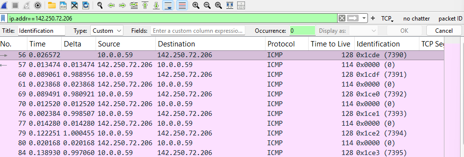
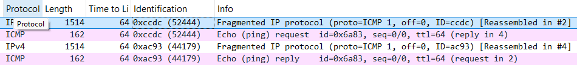
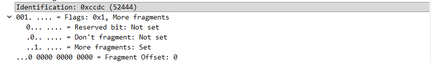
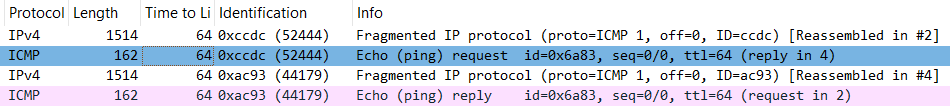
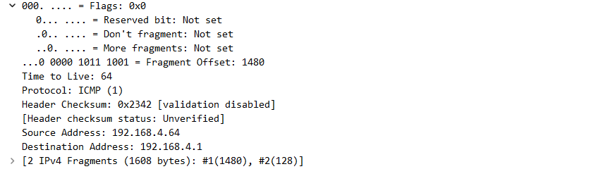
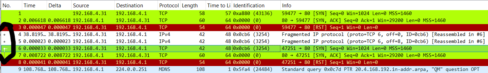
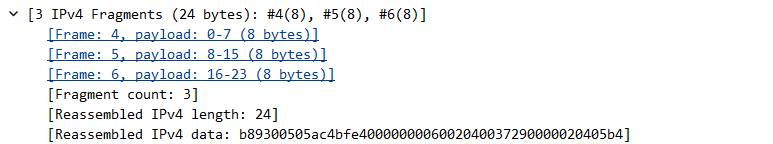
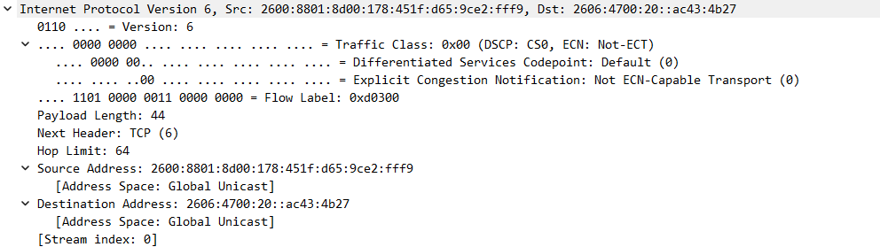

# Practical IP Analysis | Fragmentation! | IPv6

### Source: Client-Side.pcapng File

## IP Trick to look for (not an absolute)
    - Add IP ID as a column
    - If the numbers are sequential you can assume that this is a single conversation (client to server, etc.)
    - Can use ID to track conversation flow. 
    - However, if you not that the server's packets are jumping in large increments, then the server is very busing serving many clients.
    - Can also use ID numbers to fingerprint a system (not always, and some randomized)

## How to use the TTL Field

## So what am I looking at?
### Capture is a ping from my device to google.com

    1. TTL increments = 64, 128, 255
    2. So this reply started at TTL = 128
    3. Network distance = 14 hops (128-114)
    4. Capture machine ID increments by 1
    5. Server ID = 0 | Server security (no fingerprinting)

## How IP Fragmentation Works

*** This is from MAC laptop ***
    - ping 192.168.4.1 -s 1600

*** From a Windows Device ***
    - ping 192.168.4.1 -l 1600

### Max transmission for IP is 1500 bytes (1480 + 20 IP Header)

### End point receives flags and packet ID to put the transmission back together.
### Notice that echo and replys are both fragmented
### Important: TCP will often have the "Don't Fragment" flag bit set.  So how do packets larger than MTU get sent out?  Router will return icmp packet saying " I can do this but, you need to uncheck this flag bit." = Retransmission (very common)

## Alright, an NMAP Scan = Tiny Bytes

### Things to notate...
    1. Packets 4-6
        - fragmented SYN packet
        - reassembled in packet 6 (Full Syn)

 

        - notice the packet lengths (tiny tiny)
        - 3 Dots on the left = Wireshark saying they are "reassembled" and the actual packet is packet 6 (TCP SYN)

## IPv6 - It's kinda awesome...

*** Just a little bit about IPv6 Protocol ***

### Contrast from IPv4 
    - IPv6 (0x866)
    - 40 byte header
        - Traffic Class (like diff serv tag)
        - Flow Label (infrastructure devices can route more efficiently / Classify traffic)
        - Hop Limit NOT TTL!
        - NO IP ID!
        - NO FRAGMENTATION / FLAGS

