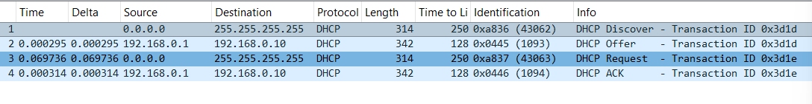
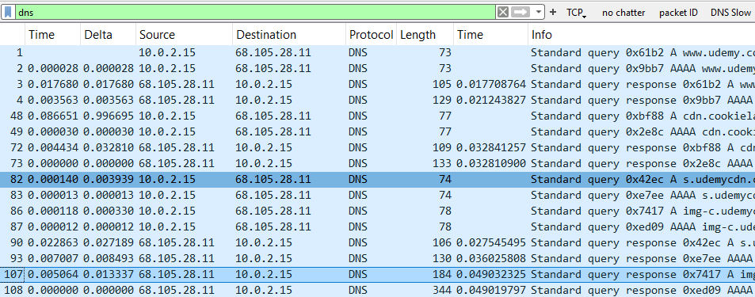

# UDP - Practical Analysis

## DHCP is pretty self explanitory at this point, but cool to see the DORA messege flow.

## Analyzing DNS

    - Tip # create dns.time filter
        - dns.time > 0.04
        - named "DNS Slow" for troubleshooting

    - Tip # Also cool
        - Create Time Column

   
  

