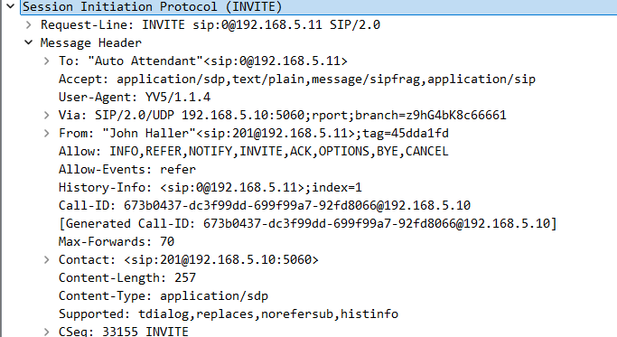
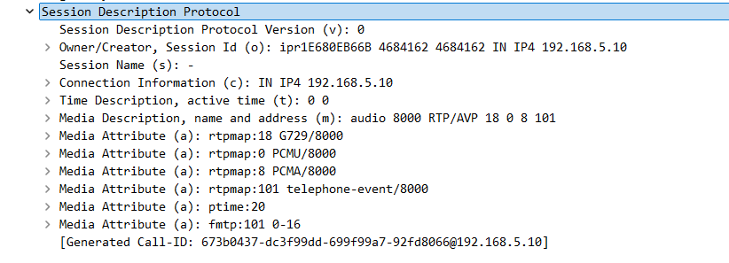
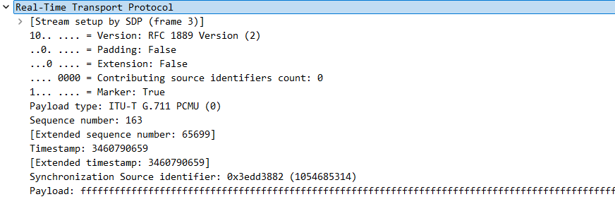

# Troubleshooting Voip and Video Streams

## Terms

### SIP - Session Initiation Protocol (INVITE)
    - signaling protocol that initites, manages, and terminates the call
### SDP - Session Description Protocol
    - serves the payload, describes the media capabilities (codecs, IP addresses, ports) to be used.

### RTP - Real Time Protocol
    - delivering audio and video data in real-time over IP networks, commonly used in VOIP, video conferencing, and streaming.

### Jitter 
    - variation or inconsistency inthe delay (latency) of packets arriving at their destination. 

## Examples:

## Ok, this is one way to trouble shoot jitter

   - Look at the Delta Time and notice 'jumps'
        EX. 0.19537 to 0.24050

    - Also, check the Differentiated Services Field
        EX. Diff Services Codepoint: Expedited Forwarding (yah/nay)

    - Could also check sequence number for variations

    - **Check both directions (source/destination)**

