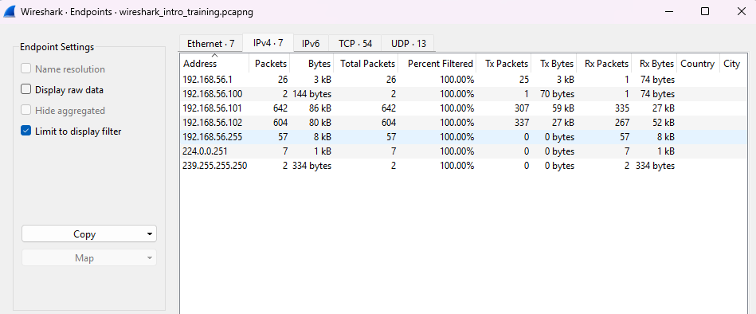
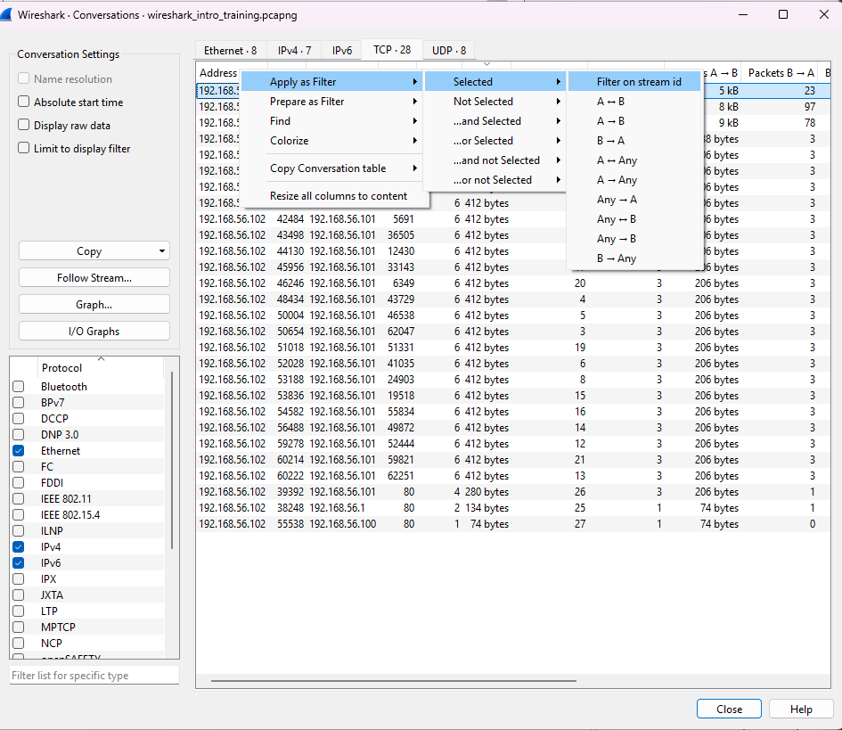
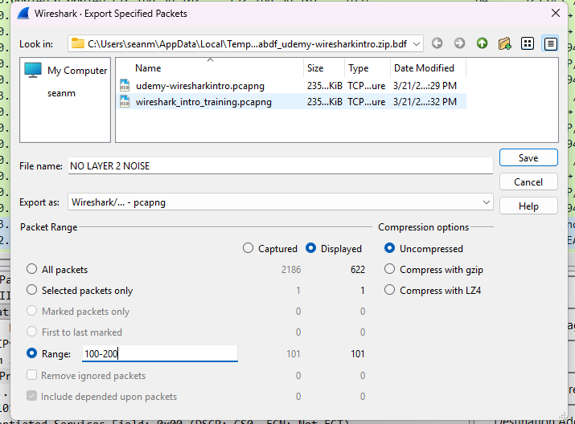

# Filtering Traffic In Wireshark

## :shark: Common Filters

Filter Type | Display Filter
-|- 
IPv4 Address                 | ip.addr==10.0.0.1
IPv4 Source / destination    | ip.src==10.0.0.1 (ip.dst==)
IPv4 Range (Subnet)          | ip.addr==10.0.0.0/24
TCP Port                     | tcp.port==80
TCP SYNs                     | tcp.flags.syn==1

## Capture Filter vs. Display Filter

Capture Filters are applied **WHILE** bringing in packets in ***capture buffer***
Display Filters are applied **AFTER THE FACT**

## Skill :muscle:##

1) Set the display filter ex. 192.168.56.0/24 > statistics > Endpoints > Limit to display filter
    - This displays all the endpoints in the subnet that are having conversations!!!:smile:

## Capturing Protocols

### Note: What is the difference between filtering for 'http' and 'tcp.port==80' ?

The http filter will only display packets **with a payload**.
tcp.port==80 will display **all Layer 4 packets** on port 80.

## Conversation Filters

## Skill :muscle:##

### Statistics > Conversation 

Get a high-level view of conversations (ip.addr + ports + bytes) > Then apply filter to conversations that are of interest!

## Operator in Display Filters

### Common Operators: 
    - eq ( == )
    - not ( ! )
    - or ( || )
    - and ( && )
    - gt ( > )
    - lt ( < )

### ** Ex.  ip.addr eq 192.168.1.1 && tcp **

## Skill: :muscle: 

### Get rid of layer 2 chadder :smile:

Filter example:   **!(arp or stp or lldp)**  ***Thank you CCNA***
Then save filter > name it "no chadder" > Boom! get rid of all the noise

### Skill: :muscle:

### Extracting Packets and Saving them to a new File
ex. Original .pcap = 500,000 packets.  Filter down to information pertinent > Save 

## Special Filters
    - contains (exact strin) | example: frame contains google ***case sensitive***
    - matches (regex) | example: http.host matches "\.(org|com|net)" ***case insensitive, use quotes***
    - in {range} | example: tcp.port in {80 443 8000..8004}

## Examples:
    frame **matches** admin
    frame **contains** "admin"
    frame **contains** GET
    http.request.method **in** {GET, POST} 

### :lightbulb: Drag field from lower-left and drop in filters

