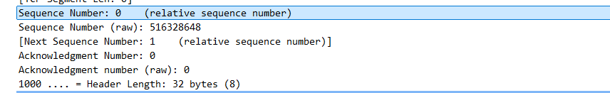
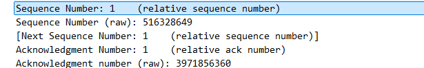
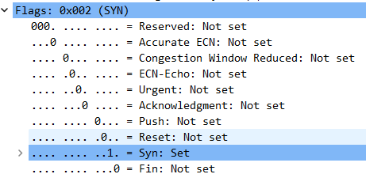
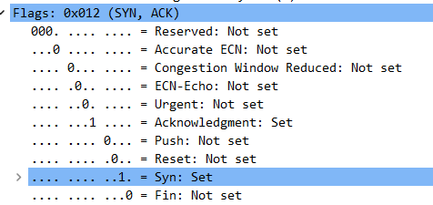
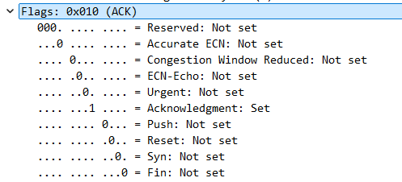
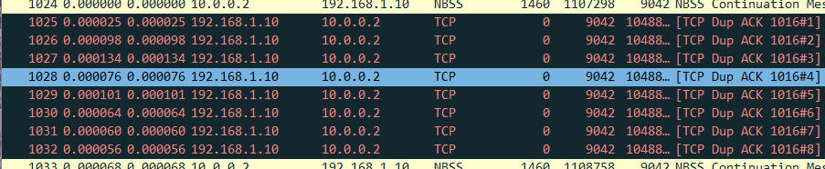
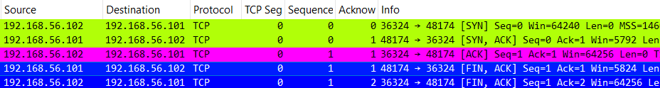
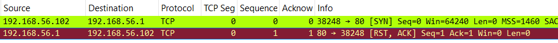
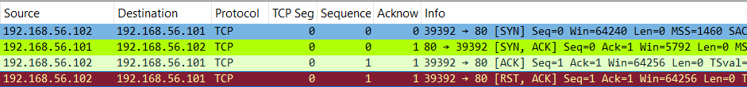

# TCP - Practical Analysis

## Command
    - Find TCP
    - Right click > Conversation Filter > TCP

**Note:** Check Delta Time - Longer response (client side) / Quick Response (Server Side) - Most likely

I am pretty comfortable with TCP with CCNA so I am just going to take Wireshark snapshots of important field

## Sequence Numbers
    - Cool thing Wireshark does is take the random sequence number EX. 516328648 (raw) and makes it 0 (relative)

## "The Flags"

## Window Size and Options

### Note:  The options are only established in packets with SYNs (syn and syn/ack)

## Important Options

    - (MSS) Maximum Segment Size: 1460 | They do not have to equal between client and server
    - Window Scale: 8 (Multiply by 256) The true value of capable window size (TCP is about a Gb)  **That's cool**
    - (SACK) Selective Ack - reduces unnecessary retransmissions improving performance on networks with high packet loss

## Retransmissions

**Note:** If there is a big block of data that got lost think Router buffer issue.

**Note:** If the errors are "spotty" retransmissions could be a layer 1 or layer 2 issue.

## Fins and Resets

### Indicators of resets ( Not all resets bad )
    - "Hey, my session just disconnected?"
    - "Strange, the app just went away."
    - "Started VPN client, and nothing happened."
    
### Graceful Shutdown

### Resets

### This is a port 80 "not listening" response
Firewalls do not send responses to therby not give information 

### This is a full connect with a reset termination (legit)

