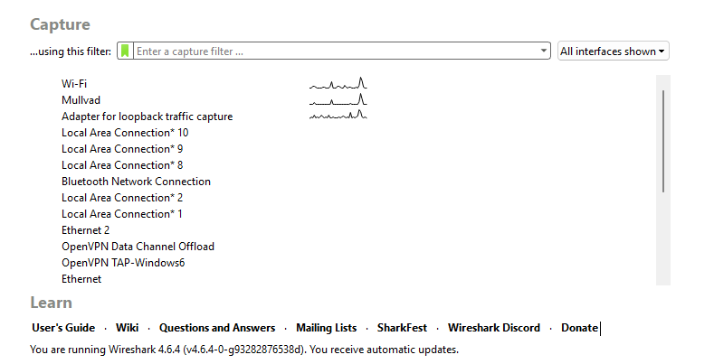
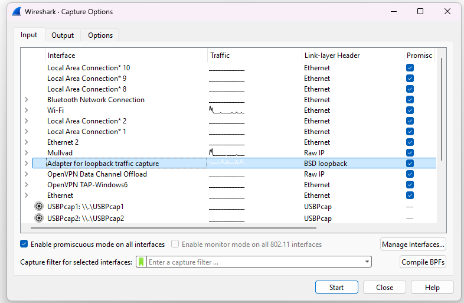
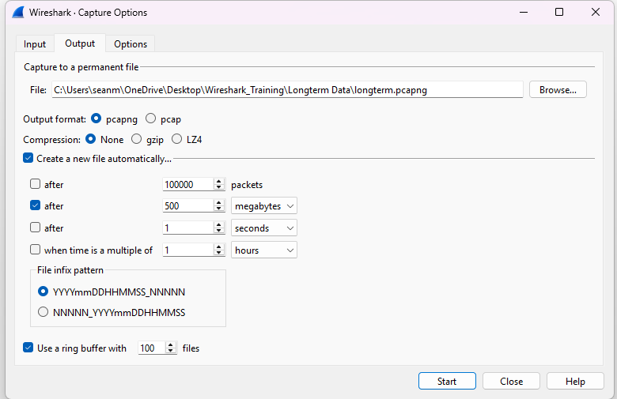
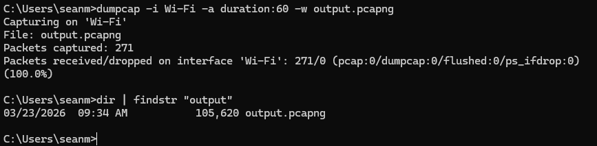
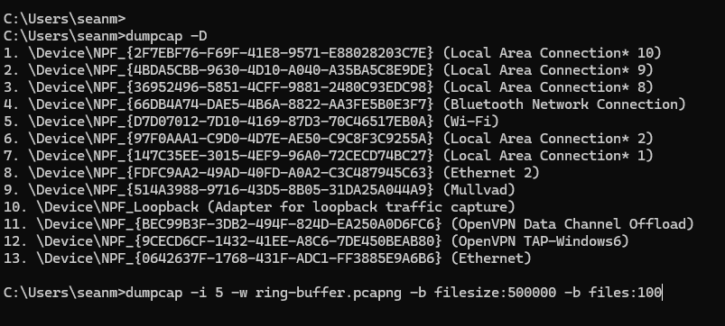

# Think Before You Capture

## Things to think about:
    - Who is impacted?
    - All the time?
    - What applications
    - What servers are they interacting with
    - What network path?

## How to capture in a switch environmnet

### Methods:
    - Directly on machine under test
        - Pro: Easy and Direct | Con: Involves users, and server resources
    - SPAN/Mirror
        - Tell router/switch to forward packets to capturing device
            - Warning: Not to send too many ports to one span port (limitations)
    - Network TAP
        - Install TAP anywhere from user to server, and install packet capture software.  Aggregates traffic to TAP and packets easily pulled off the network.

    *** Cannot just plug a laptop into a switchport and capture traffic on the network.  It will be limited to broadcast, multi-cast traffic, and to-from traffic on that port. ***

# Capturing at Multiple Locations
    - Client side capture | Server side capture
    - Troubleshooting problems: Allows for better visibility about where packet loss, and retransmissions occur.  Could be server talking to another service or server that is causing slow network for example.

# Should we use a Capture Filter?
    - When you capture traffic on the wire, but only traffic that we denote.  (EX. TCP only)
    - Answer: Probably not, it is limiting and can miss backend servers issues, or other Network Layers that could affect other layers.  
    - For now capture everything > then filter.

# Capturing Traffic:  What happens when we click on the blue fin?
    

Shows all the available interfaces to capture network traffic.  You can set a filter prior to capture, but not recommneded for beginners while learning.  Interfaces to focus on: Wi-Fi & Mullvad (VPN).  Capture traffic and compare and contrast.

### Note: Learn more about Wireshark\Bluetooth

# Using Capture Options
    - Can get more granular 
    - EX. For secure networks can use 'Snaplen' to modify the information caputured, and remove the payloads and just capture first 64 bits.

# How to capture on the command line and Wireshark UI
    - Setting up a long term capture
    - Important:  Wireshark will stop capturing manually(USER), OR WHEN THE SYSTEM CRASHES (HARDDRIVE FULL)

## Ring Buffer Settings on Wireshark UI

## Dumpcap
    1. Creat a network path to C:\Program Files\Wireshark (best practice)
    2. Using dumpcap:
    -i <interface>, --interface <interface>
    -D, --list-interfaces    print list of interfaces and exit
     -B <buffer size>, --buffer-size <buffer size>
                           size of kernel buffer in MiB (def: 2MiB)
    -w <filename>            name of file to save (def: tempfile)

    Example: dumpcap -i eth0 -a duration:60 -w output.pcapng
"Capture packets from interface eth0 until 60s passed into output.pcapng"

## Configuring A Ring-Buffer on the CLI

