# Phishing Emails in Action

## Example Email #1 Paypal Receipt

### Techniques Used:
    - spoofed email address
    - URL shortening
    - Branded HTML

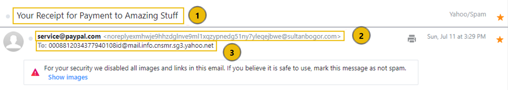 

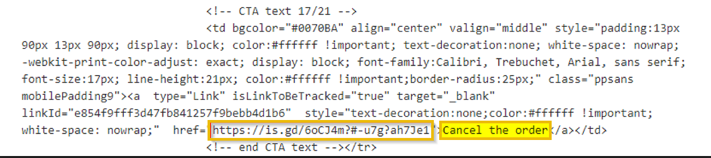

## Example Email #2 Track Your Package

### Hyperlink Tracking

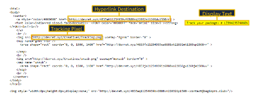

## Example Email #3 Download Document Here

### Link Redirection
### Credential Harvesting

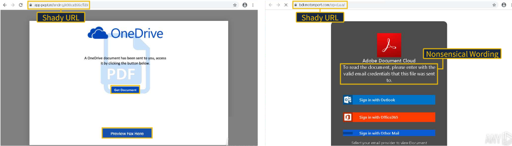

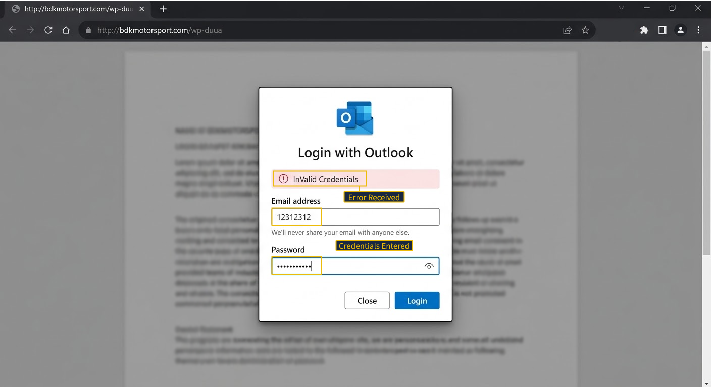

## Example Email #3 Your Account is on Hold

### Attachments

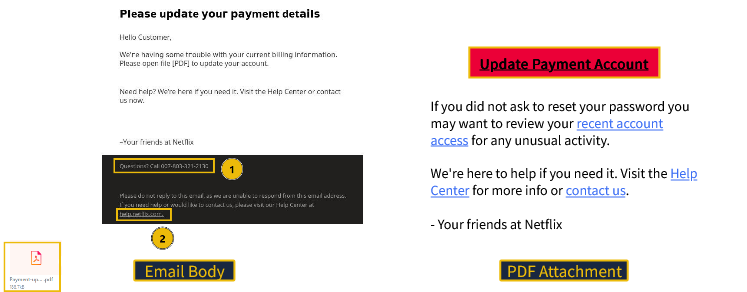

## Example Email #4 Your Recent Purchase

### Recipient is BCCed
### Attachments - email contains a **'.dot'** file for the receipt (unusual)

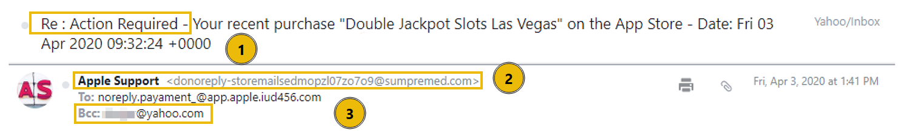

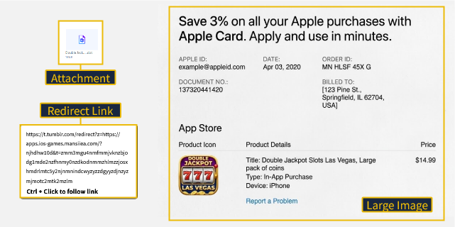

## Email Example #4 Scheduled Shipment

### brand Impersonation
### Excel doc that triggers executable code

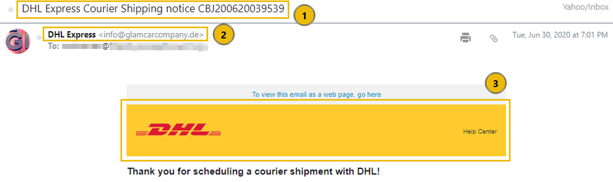

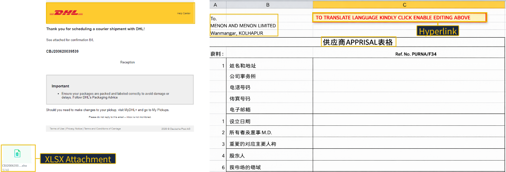

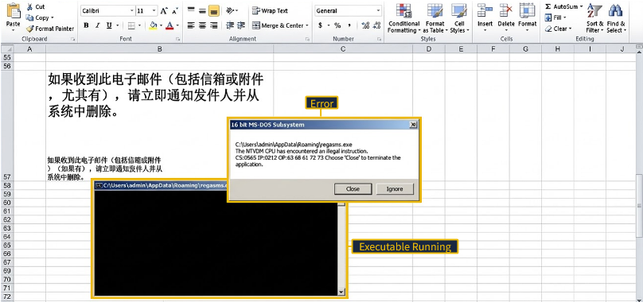

