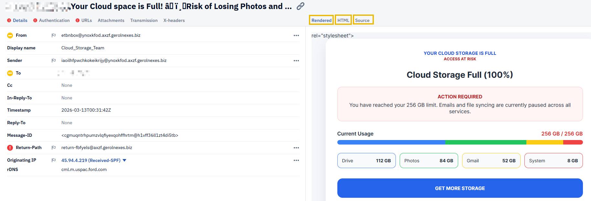
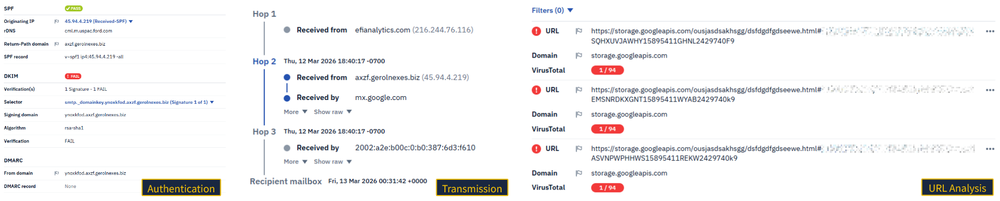
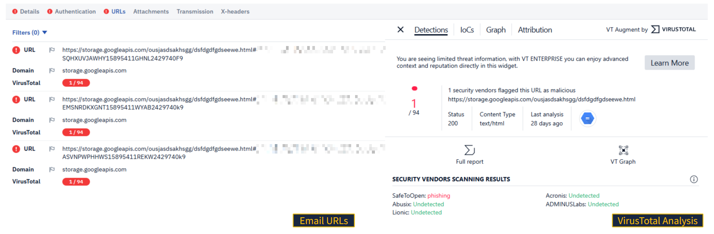
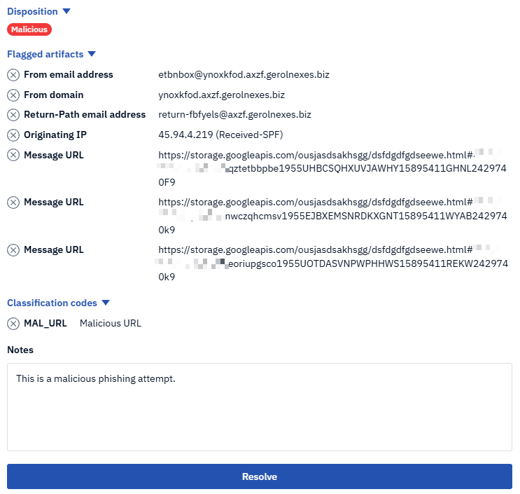

# Phishing Analysis Tools

### Tools:
    - Messageheader (Google Admin Toolbox)
    - Message Header Analyzer (mha.azurewebsite.net)
    - IPinfo
    - URLScan.io
    - URL Extraction Tool (convertcsv.com/url-extractor.htm)
    - Cisco Talos (IP, Domain, hash values)
    - Cyberchef  (decode, url extraction, defang, and more)
    - VirusTotal
    - DMARC Domain Checker (dmarcian.com/domain-checker)

### First goal in an investigation is collecting the key artifacts of the email

## Header Artifacts

    Sender email address: Where did the email originate from?
    Sender IP address: What is the source IP, and what does a reverse lookup reveal?
    Email subject line: Does it contain urgency or a call to action?
    Recipient email address: Who is the intended recipient (To/CC/BCC)?
    Reply-To email address: Where are responses being directed?
    Date and time: When was the email sent?

## Body Analysis

    URLs and hyperlinks: Identify all links and expand shortened URLs to reveal their true destination
    Attachment name(s): What files are included, and do their names or extensions appear suspicious
    Attachment hash: Generate a hash value for threat intelligence lookups

## Mail Body Analysis
    - Copy and paste a link and see what the URL is
    - For **Email Attachments** download in a safe environment and create hash for future analysis

## Malware Sandboxes

    - ANY.RUN
    - Hybrid Analysis
    - JOESandbox

## using PhishTool

### Plug and Play!

### Authentication, Transmission, and URL Analysis

### VirusTotal Integration

### Formal Documentation

