Site: tryhackme.com

Room: Snapped Phish-ing Line

Date: 2026:08:04


## Objectives

Analyze the provided email samples to identify key artifacts
Investigate phishing URLs to understand redirection
Retrieve and examine the phishing kit used in the attack
Use CTI tools to gather intelligence on the adversary
Analyze the phishing kit to uncover additional indicators
Prerequisites

## Answer the questions below:

## Begin reviewing the emails in the phish-emails folder on your desktop.

## Which individual received the email regarding a Quote for Services Rendered?

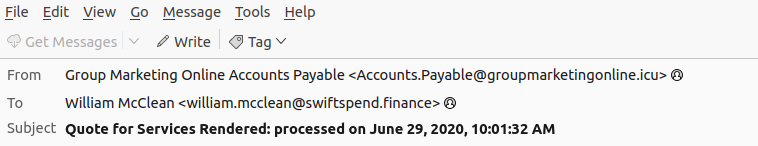

```
Answer format: William McClean

```

## What email address was used by the adversary to send the phishing emails?


```
Answer format: Accounts.Payable@groupmarketingonline.icu

```

## Investigate the attachment in the email addressed to Zoe Duncan.
## What is the root domain of the redirection URL found within the file?

### First: Grab the base64 encodeded data at the bottom of the 'message source' information

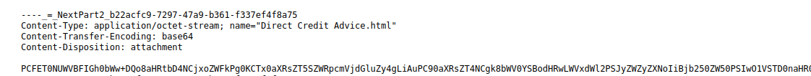

### Second: Decode the base64 encoded data ( I chose cyberchef in this example)

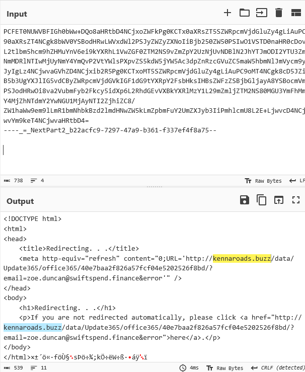

```
Answer format: kennaroads.buzz

```


## Open the attachment in your VM web browser.
## Which company is the login page impersonating?


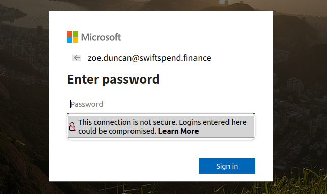

```
Answer format: Microsoft

```

## Let’s check if the attacker left any files exposed on the same website.
## Navigate to the /data directory.
## What is the name of the archive file?

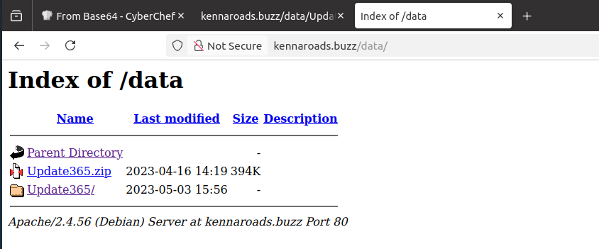

Answer format: Update365.zip


## Download the phishing kit archive to your virtual environment.
## Using the sha256sum command, what is the SHA256 hash of the file?

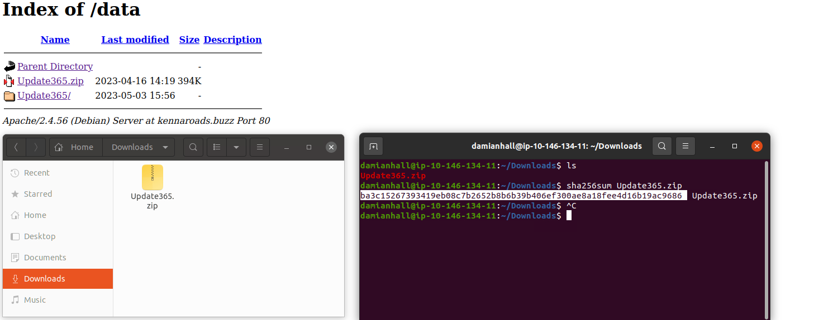

```

Answer format: ba3c15267393419eb08c7b2652b8b6b39b406ef300ae8a18fee4d16b19ac9686

```

## Investigate the file hash from the previous question using VirusTotal (opens in new tab).
## Aside from phishing, what other threat category is assigned to the ZIP archive?


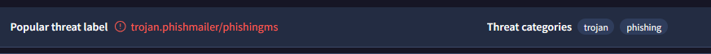

```

Answer format: Trojan

```


## Review the VirusTotal Details page for the phishing kit.
## How many files are contained within the archive?

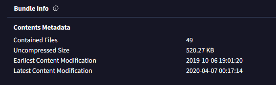

```

Answer format: 49

```


## Let’s see if the attacker has exposed any captured credentials.
## Navigate to the /data/Update365/ directory and investigate the log file.
## What is the email address of the user who submitted their credentials more than once?

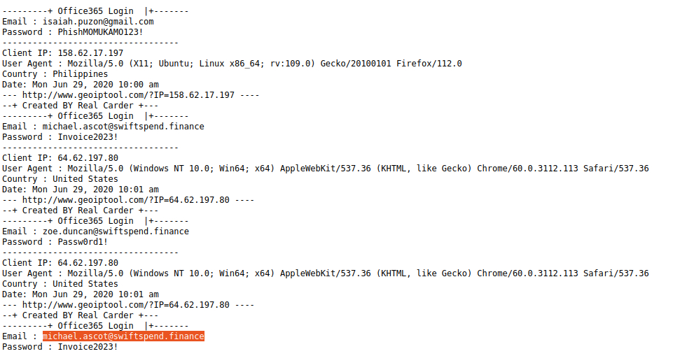

```

Answer format: michael.ascot@swiftspend.finance

```

## Extract the phishing kit archive and locate the submit.php file.
## What email address is used by the adversary to collect compromised credentials?

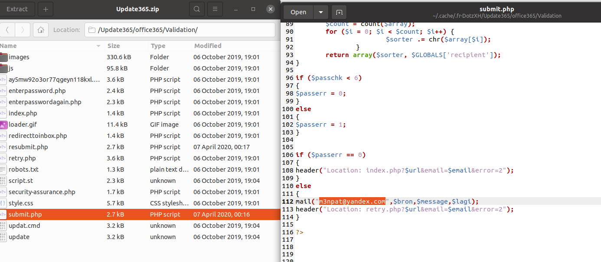

```

Answer format: m3npat@yandex.com

```

## Return to the phishing URL and locate the flag.txt file.
## Using CyberChef (opens in new tab) to decode the flag, what is the secret value?

## Step 1:

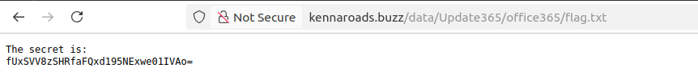

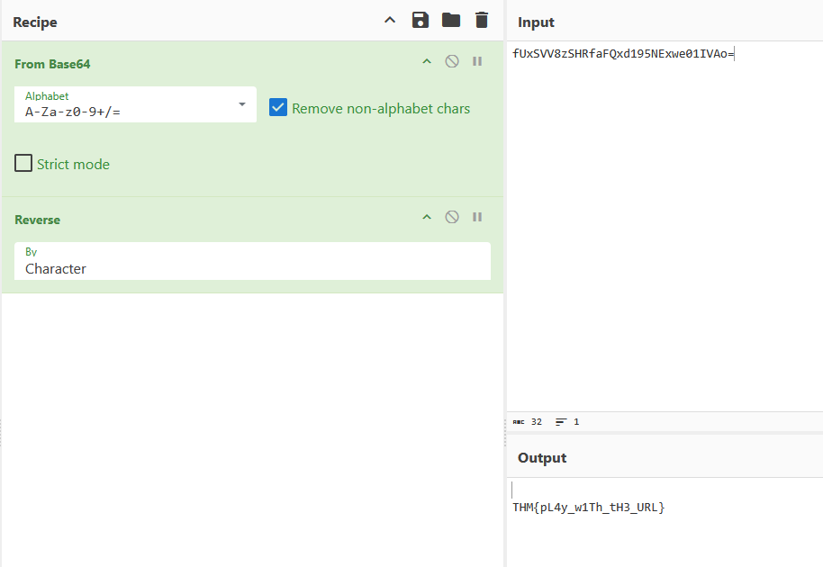

## Answer format: THM{pL4y_w1Th_tH3_URL} 
